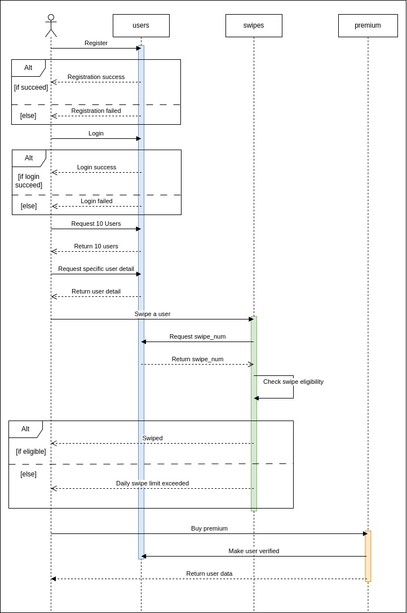

# Yangder Technical Documentation
Yang (/jeɪŋ/) means couple in Javanese slang. Yangder is a find-a-partner application that matches you with your potential mate.

## Github Repository URL
https://github.com/natanhp/yangnder

## Requirements
### Functional
1. The user can sign up for the app.
2. The user can log in to the app.
3. The user can view and swipe up to 10 profiles a day.
4. The same profiles must not appear more than once on the same day.
5. User can purchase premium packages to add a verified label to their profile.

### Non-functional
1. Password with Argon2id with a minimum configuration of 19 MiB of memory, an iteration count of 2, and 1 degree of parallelism as recommended by OWASP.
2. Use JSON Web Token for API Security.

## Tech Stacks
1. Go as the programming language because it is a simple yet fast language with huge community support.
2. Gin as the web framework because it is simple but loaded with complete features.
3. SQLite as the database because it requires no server and is suited for a simple application.

## System Design
### ER Diagram

### Sequence Diagram

## List of Test Cases
No | Test Case Scenario | Expected Results
--- | --- | --- 
1 | Make sure user can buy verified label | User object contains `"is_verified": true` 
2 | Make sure the user can swipe right to another user | `r_swipes` object created containing the user ID from the swiper and the one that got swiped.
3 | Make sure the user can only swipe right another existing user | Error `User not found` when swiping on a non-existing user
4 | Make sure only user with `swipe_num > 0` can swipe right | Error `Out of swipes` when user with `swipe_num <= 0` swiping right on another user.
5 | Make sure only the user that is not already related to the swiper in `l_swipes` can be swiped right | Error `Already swiped` when swiped user already related to the swiper in `l_swipes`
6 | Make sure only the user that is not already related to the swiper in `r_swipes` can be swiped right | Error `Already swiped` when swiped user already related to the swiper in `r_swipes`
7 | Make sure the user can swipe left another user | `l_swipes` object created containing user ID from swiper and the one that got swiped and `delete_on` containing date time when this row should be deleted.
8 | Make sure the user can only swipe left on another existing user | Error `User not found` when swiping on a non-existing user
9 | Make sure only user with `swipe_num > 0` can swipe left | Error `Out of swipes` when user with `swipe_num <= 0` swiping left on another user.
10 | Make sure only the user that is not already related to the swiper in `l_swipes` can be swiped left | Error `Already swiped` when swiped user already related to the wiper in `l_swipes`
10 | Make sure only the user that is not already related to the swiper in `r_swipes` can be swiped left | Error `Already swiped` when swiped user already related to the swiper in `l_swipes`
11 | Make sure can find all users | Return more than one user
12 | Make sure can get user detail | Return user detail
13 | Make sure can create new user | Return new created user
14 | Make sure email is unique | Error `Email already taken` when registering with an existing email
15 | Make sure the user can upload the photo | Return the user object with the photo file name in `photo`
16 | Make sure the user can't upload an empty photo | Error `Photo is required` when a photo is empty
17 | Make sure the user can log in | Return logged-in user information and token
18 | Make sure only registered email can be used to login | Error `Invalid email or password` when non-registered email is being used
19 | Make sure only matched hashed can be used with the sent password | Error `Invalid email or password`
20 | Make sure `swipe_num` always be reset in daily basis | Update `swipe_num` and set it to 10 and update the `next_swipe_reset` to current time + a day.
21 | Make sure all record in `l_swipes` will be deleted if `delete_on` is smaller than current date time | No record of `l_swipes` if the `delete_on` is 